# 📊 EventTickets - Mermaid Diagrams Documentation

This document contains all system diagrams in Mermaid syntax for easy visualization on [Mermaid Live Editor](https://mermaid.live/).

---

## Table of Contents

1. [System Architecture](#1-system-architecture)
2. [Microservices Communication](#2-microservices-communication)
3. [User Authentication Flow](#3-user-authentication-flow)
4. [Event Lifecycle](#4-event-lifecycle)
5. [Reservation Lifecycle](#5-reservation-lifecycle)
6. [Ticket Reservation Flow](#6-ticket-reservation-flow)
7. [Payment Processing Flow](#7-payment-processing-flow)
8. [Database Entity Relationships](#8-database-entity-relationships)
9. [API Gateway Routing](#9-api-gateway-routing)
10. [Concurrency Management](#10-concurrency-management)
11. [Class Diagrams](#11-class-diagrams)
12. [Deployment Architecture](#12-deployment-architecture)
13. [Sequence Diagrams](#13-sequence-diagrams)

---

## 1. System Architecture

### 1.1 High-Level Architecture

```mermaid
flowchart TB
    subgraph Frontend["🖥️ Frontend Layer"]
        WEB["Vue.js/React App<br/>Port: 5173"]
    end

    subgraph Gateway["🚪 API Gateway Layer"]
        GW["API Gateway<br/>Node.js/Express<br/>Port: 3000"]
    end

    subgraph Services["🔧 Microservices Layer"]
        US["User Service<br/>Node.js/Prisma<br/>Port: 3001"]
        ECS["Event Catalog<br/>Spring Boot<br/>Port: 8080"]
        TIS["Ticket Inventory<br/>Spring Boot<br/>Port: 8082"]
        PNS["Payment & Notification<br/>Laravel/PHP<br/>Port: 8083"]
    end

    subgraph Database["💾 Database Layer"]
        DB1[("user_service_db")]
        DB2[("eventtickets_db")]
        DB3[("ticket_inventory_db")]
        DB4[("payment_notification_db")]
    end

    WEB -->|HTTP/HTTPS| GW
    GW -->|JWT Auth| US
    GW -->|REST| ECS
    GW -->|REST| TIS
    GW -->|REST| PNS
    
    US --> DB1
    ECS --> DB2
    TIS --> DB3
    PNS --> DB4

    style Frontend fill:#e1f5fe
    style Gateway fill:#fff3e0
    style Services fill:#e8f5e9
    style Database fill:#fce4ec
```



### 1.2 Layered Architecture (Per Service)


---

## 2. Microservices Communication

### 2.1 Service Communication Flow


### 2.2 Inter-Service Dependencies


---

## 3. User Authentication Flow

### 3.1 Registration Flow


### 3.2 Login Flow


### 3.3 JWT Token Structure


---

## 4. Event Lifecycle

### 4.1 Event State Machine


### 4.2 Event Management Flow


---

## 5. Reservation Lifecycle

### 5.1 Reservation State Machine


### 5.2 Reservation Timer Flow


---

## 6. Ticket Reservation Flow

### 6.1 Complete Reservation Sequence


### 6.2 Concurrency Control

```mermaid
sequenceDiagram
    participant A as User A
    participant B as User B
    participant S as Service
    participant DB as Database

    Note over A,DB: Both request 5 tickets (10 available)
    
    A->>S: Reserve 5 tickets
    B->>S: Reserve 5 tickets
    
    S->>DB: PESSIMISTIC_WRITE lock
    DB-->>S: Inventory locked
    
    Note over S: Process User A first
    S->>DB: Update reserved = 5
    S-->>A: ✓ Reserved 5 tickets
    
    S->>DB: Release lock
    DB-->>S: Lock released
    
    S->>DB: PESSIMISTIC_WRITE lock
    DB-->>S: Inventory (5 available)
    
    Note over S: Process User B
    S->>DB: Update reserved = 10
    S-->>B: ✓ Reserved 5 tickets

    Note over A,DB: No overbooking possible
```



---

## 7. Payment Processing Flow

### 7.1 Payment Sequence


### 7.2 Payment States


### 7.3 Refund Flow


---

## 8. Database Entity Relationships

### 8.1 User Service Database


### 8.2 Event Catalog Database


### 8.3 Ticket Inventory Database


### 8.4 Payment Database


### 8.5 Cross-Service Relationships

```mermaid
flowchart TD
    subgraph UserDB["User Service DB"]
        U[Users]
        R[Roles]
    end
    
    subgraph EventDB["Event Catalog DB"]
        E[Events]
        V[Venues]
        C[Categories]
    end
    
    subgraph InventoryDB["Ticket Inventory DB"]
        I[Inventory]
        RES[Reservations]
        T[Tickets]
    end
    
    subgraph PaymentDB["Payment DB"]
        P[Payments]
        N[Notifications]
    end
    
    E -.->|organizerId| U
    I -.->|eventId| E
    RES -.->|userId| U
    RES -.->|eventId| E
    P -.->|userId| U
    P -.->|eventId| E
    P -.->|ticketId| T
    
    style UserDB fill:#e3f2fd
    style EventDB fill:#e8f5e9
    style InventoryDB fill:#fff3e0
    style PaymentDB fill:#fce4ec
```

---

## 9. API Gateway Routing

### 9.1 Route Configuration

```mermaid
flowchart TD
    subgraph Incoming["Incoming Requests"]
        R1["POST /auth/*"]
        R2["GET /events/*"]
        R3["POST /inventory/*"]
        R4["POST /payments/*"]
        R5["GET /inventory/availability/*"]
    end
    
    subgraph Gateway["API Gateway :3000"]
        CORS["CORS Middleware"]
        LOG["Logging Middleware"]
        AUTH["Auth Middleware"]
        PROXY["Proxy Router"]
    end
    
    subgraph Services["Backend Services"]
        US["User Service :3001"]
        ECS["Event Catalog :8080"]
        TIS["Ticket Inventory :8082"]
        PNS["Payment Service :8083"]
    end
    
    R1 --> CORS --> LOG --> AUTH --> PROXY
    R2 --> CORS --> LOG --> AUTH --> PROXY
    R3 --> CORS --> LOG --> AUTH --> PROXY
    R4 --> CORS --> LOG --> AUTH --> PROXY
    R5 --> CORS --> LOG --> PROXY
    
    PROXY -->|/auth/*| US
    PROXY -->|/events/*| ECS
    PROXY -->|/inventory/*| TIS
    PROXY -->|/payments/*| PNS
```

### 9.2 Middleware Pipeline

```mermaid
flowchart LR
    A[Request] --> B[CORS]
    B --> C[Body Parser]
    C --> D[Request Logger]
    D --> E{Public Route?}
    E -->|Yes| G[Proxy]
    E -->|No| F[JWT Validation]
    F --> G
    G --> H[Backend Service]
    H --> I[Response Logger]
    I --> J[Response]
```

---

## 10. Concurrency Management

### 10.1 Pessimistic Locking Strategy

```mermaid
flowchart TD
    A[Request to Reserve] --> B[Start Transaction]
    B --> C[Acquire PESSIMISTIC_WRITE Lock]
    C --> D{Lock Acquired?}
    D -->|Yes| E[Read Inventory]
    D -->|No| F[Wait for Lock]
    F --> D
    E --> G{Sufficient Stock?}
    G -->|Yes| H[Update Inventory]
    H --> I[Create Reservation]
    I --> J[Commit Transaction]
    J --> K[Release Lock]
    G -->|No| L[Rollback]
    L --> M[Return Error]
    K --> N[Return Success]
```

### 10.2 Idempotency Check

```mermaid
flowchart TD
    A[Reserve Request] --> B{Has Idempotency Key?}
    B -->|No| C[Generate Key]
    B -->|Yes| D[Check Key in DB]
    C --> D
    D --> E{Key Exists?}
    E -->|Yes| F[Return Existing Reservation]
    E -->|No| G[Process New Reservation]
    G --> H[Store Key + Result]
    H --> I[Return Result]
```

---

## 11. Class Diagrams

### 11.1 Ticket Inventory Service

```mermaid
classDiagram
    class TicketController {
        -TicketInventoryService service
        +reserveTickets(ReserveRequest) ReserveResponse
        +confirmReservation(Long id) Response
        +releaseReservation(Long id) Response
        +getAvailability(Long eventId) AvailabilityResponse
        +getUserReservations(Long userId) List~Reservation~
    }
    
    class TicketInventoryService {
        -InventoryRepository inventoryRepo
        -ReservationRepository reservationRepo
        -EventCatalogClient eventClient
        +reserve(ReserveRequest) Reservation
        +confirm(Long id) void
        +release(Long id) void
        +checkAvailability(Long eventId) Inventory
    }
    
    class ReservationCleanupService {
        -ReservationRepository repo
        -InventoryRepository inventoryRepo
        +cleanupExpiredReservations() void
    }
    
    class Inventory {
        -Long eventId
        -Integer total
        -Integer reserved
        -Integer version
        +getAvailable() Integer
    }
    
    class Reservation {
        -Long id
        -Long eventId
        -Long userId
        -Integer quantity
        -ReservationStatus status
        -LocalDateTime holdExpiresAt
        -String idempotencyKey
    }
    
    class Ticket {
        -Long id
        -Long reservationId
        -Long userId
        -Long eventId
        -String qrCode
    }
    
    TicketController --> TicketInventoryService
    TicketInventoryService --> Inventory
    TicketInventoryService --> Reservation
    Reservation --> Ticket
```

### 11.2 Payment Service

```mermaid
classDiagram
    class PaymentController {
        -PaymentService service
        +createPayment(PaymentRequest) Payment
        +getPayment(Long id) Payment
        +getUserPayments(Long userId) List~Payment~
        +refundPayment(Long id) Payment
    }
    
    class PaymentService {
        -PaymentRepository repo
        -NotificationService notificationService
        +processPayment(PaymentRequest) Payment
        +refund(Long id) Payment
    }
    
    class NotificationService {
        -NotificationRepository repo
        -MailService mailService
        +sendPaymentConfirmation(Payment) void
        +sendRefundNotification(Payment) void
    }
    
    class Payment {
        -Long id
        -String transactionId
        -Long userId
        -Long eventId
        -Decimal amount
        -PaymentStatus status
        -String method
    }
    
    class Notification {
        -Long id
        -Long userId
        -NotificationType type
        -String subject
        -String message
        -NotificationStatus status
    }
    
    PaymentController --> PaymentService
    PaymentService --> NotificationService
    PaymentService --> Payment
    NotificationService --> Notification
```

---

## 12. Deployment Architecture

### 12.1 Docker Compose Architecture

```mermaid
flowchart TB
    subgraph Docker["Docker Compose Environment"]
        subgraph Network["eventtickets-network"]
            WEB["web<br/>nginx:5173"]
            GW["api-gateway<br/>node:3000"]
            US["user-service<br/>node:3001"]
            ECS["event-catalog<br/>java:8080"]
            TIS["ticket-inventory<br/>java:8082"]
            PNS["payment-service<br/>php:8083"]
            DB["mysql<br/>:3306"]
        end
    end
    
    WEB --> GW
    GW --> US
    GW --> ECS
    GW --> TIS
    GW --> PNS
    
    US --> DB
    ECS --> DB
    TIS --> DB
    PNS --> DB
```

### 12.2 Container Dependencies

```mermaid
flowchart TD
    DB[("MySQL<br/>Database")]
    
    US["User Service"]
    ECS["Event Catalog"]
    TIS["Ticket Inventory"]
    PNS["Payment Service"]
    
    GW["API Gateway"]
    WEB["Web Frontend"]
    
    DB --> US
    DB --> ECS
    DB --> TIS
    DB --> PNS
    
    US --> GW
    ECS --> GW
    TIS --> GW
    PNS --> GW
    
    GW --> WEB
    
    style DB fill:#f9f9f9
```

### 12.3 Port Mapping

```mermaid
flowchart LR
    subgraph Host["Host Machine"]
        P1["Port 5173"]
        P2["Port 3000"]
        P3["Port 3001"]
        P4["Port 8080"]
        P5["Port 8082"]
        P6["Port 8083"]
        P7["Port 3306"]
    end
    
    subgraph Containers["Docker Containers"]
        C1["web:80"]
        C2["api-gateway:3000"]
        C3["user-service:3001"]
        C4["event-catalog:8080"]
        C5["ticket-inventory:8082"]
        C6["payment-service:8083"]
        C7["mysql:3306"]
    end
    
    P1 <--> C1
    P2 <--> C2
    P3 <--> C3
    P4 <--> C4
    P5 <--> C5
    P6 <--> C6
    P7 <--> C7
```

---

## 13. Sequence Diagrams

### 13.1 Complete Booking Journey

```mermaid
sequenceDiagram
    actor User
    participant Frontend
    participant Gateway
    participant UserService
    participant EventCatalog
    participant TicketInventory
    participant PaymentService
    participant Email

    %% Authentication
    User->>Frontend: Login
    Frontend->>Gateway: POST /auth/login
    Gateway->>UserService: Authenticate
    UserService-->>Gateway: JWT Token
    Gateway-->>Frontend: Token + User
    Frontend->>Frontend: Store Token

    %% Browse Events
    User->>Frontend: Browse Events
    Frontend->>Gateway: GET /events
    Gateway->>EventCatalog: Get Events
    EventCatalog-->>Frontend: Event List

    %% Select Event
    User->>Frontend: Select Event
    Frontend->>Gateway: GET /events/{id}
    Gateway->>EventCatalog: Get Event Details
    EventCatalog-->>Frontend: Event Details

    %% Check Availability
    Frontend->>Gateway: GET /inventory/availability/{id}
    Gateway->>TicketInventory: Check Stock
    TicketInventory-->>Frontend: Available Tickets

    %% Reserve Tickets
    User->>Frontend: Reserve 2 Tickets
    Frontend->>Gateway: POST /inventory/reserve
    Gateway->>TicketInventory: Create Reservation
    TicketInventory-->>Frontend: Reservation (15 min hold)

    %% Payment
    User->>Frontend: Enter Payment
    Frontend->>Gateway: POST /payments
    Gateway->>PaymentService: Process Payment
    PaymentService->>TicketInventory: Confirm Reservation
    TicketInventory-->>PaymentService: Confirmed
    PaymentService->>Email: Send Confirmation
    PaymentService-->>Frontend: Success + Tickets

    User->>Frontend: View Tickets
```

### 13.2 Reservation Expiration Cleanup

```mermaid
sequenceDiagram
    participant Scheduler
    participant CleanupService
    participant ReservationRepo
    participant InventoryRepo
    participant DB

    loop Every 1 minute
        Scheduler->>CleanupService: Run Cleanup
        CleanupService->>ReservationRepo: Find expired PENDING
        ReservationRepo->>DB: SELECT * WHERE status='PENDING' AND expires_at < NOW()
        DB-->>ReservationRepo: Expired reservations
        
        loop For each expired reservation
            CleanupService->>ReservationRepo: Update status to EXPIRED
            ReservationRepo->>DB: UPDATE status='EXPIRED'
            CleanupService->>InventoryRepo: Release tickets
            InventoryRepo->>DB: UPDATE reserved -= quantity
        end
        
        CleanupService-->>Scheduler: Cleanup complete
    end
```

### 13.3 Event Creation by Organizer

```mermaid
sequenceDiagram
    actor Organizer
    participant Frontend
    participant Gateway
    participant EventCatalog
    participant TicketInventory
    participant DB

    Organizer->>Frontend: Create Event Form
    Frontend->>Gateway: POST /events
    Note over Gateway: Check JWT & Role=ORGANIZER
    Gateway->>EventCatalog: Create Event
    EventCatalog->>DB: INSERT event
    DB-->>EventCatalog: Event ID
    EventCatalog-->>Gateway: Created Event
    Gateway-->>Frontend: Event Created

    Organizer->>Frontend: Add Ticket Types
    Frontend->>Gateway: POST /inventory/ticket-types
    Gateway->>TicketInventory: Create Inventory
    TicketInventory->>DB: INSERT inventory
    TicketInventory-->>Frontend: Inventory Created

    Organizer->>Frontend: Publish Event
    Frontend->>Gateway: PUT /events/{id}/publish
    Gateway->>EventCatalog: Update Status
    EventCatalog->>DB: UPDATE status='PUBLISHED'
    EventCatalog-->>Frontend: Event Published
```

---

## 📝 Usage Instructions

### Viewing Diagrams

1. **Mermaid Live Editor**: Copy any diagram code block and paste at [mermaid.live](https://mermaid.live/)

2. **VS Code Extension**: Install "Markdown Preview Mermaid Support" extension

3. **GitHub**: GitHub natively renders Mermaid diagrams in markdown files

4. **Notion**: Use code blocks with `mermaid` language

### Exporting Diagrams

From Mermaid Live Editor, you can export as:
- PNG (for documentation)
- SVG (for web)
- PDF (for printing)

---

## 🔗 Quick Links

| Diagram Type | Use Case |
|--------------|----------|
| Flowchart | Architecture, processes |
| Sequence | API interactions |
| State | Lifecycles (Event, Reservation) |
| ERD | Database design |
| Class | Code structure |
| Gantt | Project timeline |

---

*Generated for EventTickets Microservices Platform - December 2025*
